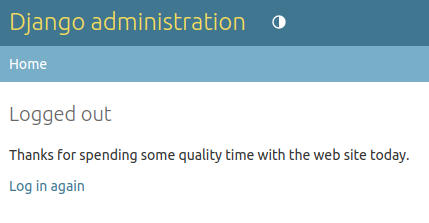

Assim como o login, o app `#!python 'django.contrib.auth'` já possui uma url e view para fazer o logout. Para utilizá-la, devemos fazer uma requisição POST. Como [vimos anteriormente](../metodo-post/verbos-http.md), podemos fazer um POST usando um formulário.

!!! exercise id_logout
    Ao lado do nome do usuário, no template base, adicione o seguinte formulário:

    ```html
    --8<-- "aulas/web/autenticacao/template-logout.html"
    ```

    Recarregue a página e aperte o botão para sair. É esperado que ocorra um erro.

!!! exercise id_csrf
    Nós já aprendemos a corrigir esse erro. Ele está relacionado ao ataque CSRF. [Adicione o token CSRF](../metodo-post/verbos-http.md#o-ataque-csrf) para corrigir o erro e tente fazer o logout novamente.

Agora o logout deve funcionar, mas você deve ter sido redirecionado para uma página como esta:



Assim como para o login, também é possível configurar a URL de redirecionamento após o logout com a configuração [`#!python LOGOUT_REDIRECT_URL`](https://docs.djangoproject.com/en/4.2/topics/auth/default/#django.contrib.auth.views.LogoutView.next_page).

!!! exercise id_logout-redirect
    Adicione a configuração abaixo depois da linha do redirecionamento do login:

    ```python
    LOGOUT_REDIRECT_URL = '/'
    ```

    Teste o fluxo completo novamente: faça o login e depois o logout. Você deve ser redirecionado automaticamente para a página principal.

Agora veremos como [forçar a obrigatoriedade do login em uma determinada view](forcando-login.md).
