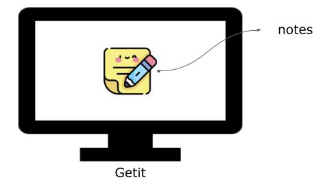

Precisamos começar definindo uma importante diferença de conceitos no Django: projetos e apps. Apps são partes de um sistema responsáveis por uma tarefa específica. Um projeto é um conjunto de um ou mais apps e pode ser entendido como o sistema em si. Por exemplo: em um sistema de vendas online, podemos ter um app responsável pelos produtos, outro app responsável pelo pagamento e outras operações financeiras, outro app responsável pelos usuários, e assim por diante. Todos esses apps podem ser utilizados em um mesmo projeto. Eles funcionam como "mini programas" que interagem entre si.


No nosso projeto de acompanhamento de estudos (checks), você desenvolverá um sistema de anotações chamado **Get-it** (é como o Post-it, mas com outro verbo). Considerando a diferenciação dos conceitos feita anteriormente, no nosso caso provavelmente teremos apenas um app dentro do nosso projeto. Vamos criar o app chamado `notes`.



!!! exercise id_gera-app
    Execute o seguinte comando:

    ```
    python manage.py startapp notes
    ```

Esse comando vai criar um diretório com alguns arquivos. Por enquanto não vamos [entrar em detalhes]()[^1] sobre o que cada um deles faz. Quando precisarmos de algum deles nós explicaremos a sua função.

[^1]: **Aprofundando os conhecimentos sobre uma biblioteca**

    Acabamos de ver que o programa `manage.py` possui comandos que criam estruturas inteiras de arquivos. Ainda veremos alguns outros comandos até mais interessantes. No caso do `startapp`, você poderia criar cada um desses arquivos manualmente e o resultado seria o mesmo. O comando apenas facilita esse processo, que sempre será o mesmo (é o que chamamos de *boilerplate*), mas é importante que aos poucos você entenda mais a fundo o que realmente acontece. Não teremos tempo para isso na disciplina, então vai depender de você se aprofundar nos temas e bibliotecas que te interessem. No momento, não importa qual, mas é importante que você se aprofunde em alguma.

Sempre que criamos um app do Django, é necessário adicioná-lo à lista de apps disponíveis para o projeto. Isso deve ser feito no arquivo de configuração (`nome_do_projeto/settings.py`).

!!! exercise id_adiciona-app-no-settings
    Abra o arquivo `getit/settings.py` e procure por `#!python INSTALLED_APPS`. Ela deve ser parecida com essa:

    ```python
    INSTALLED_APPS = [
        'django.contrib.admin',
        'django.contrib.auth',
        'django.contrib.contenttypes',
        'django.contrib.sessions',
        'django.contrib.messages',
        'django.contrib.staticfiles',
    ]
    ```

    Para o Django encontrar o nosso novo app, adicione a string `#!python 'notes.apps.NotesConfig',` (**note a vírgula depois `'notes.apps.NotesConfig'`**) como o primeiro elemento da lista `#!python INSTALLED_APPS`. Caso tenha curiosidade, a classe `#!python NotesConfig` foi criada automaticamente no arquivo `notes/apps.py`.

    **Importante:** este passo é crucial para o funcionamento do próximo handout. Sem isso, o Django não encontrará alguns dos nossos arquivos.

Finalmente terminamos as etapas de configuração. Agora podemos retomar a discussão sobre implementação. Para isso, utilizaremos um [exemplo concreto](../primeiro-modelo/index.md).