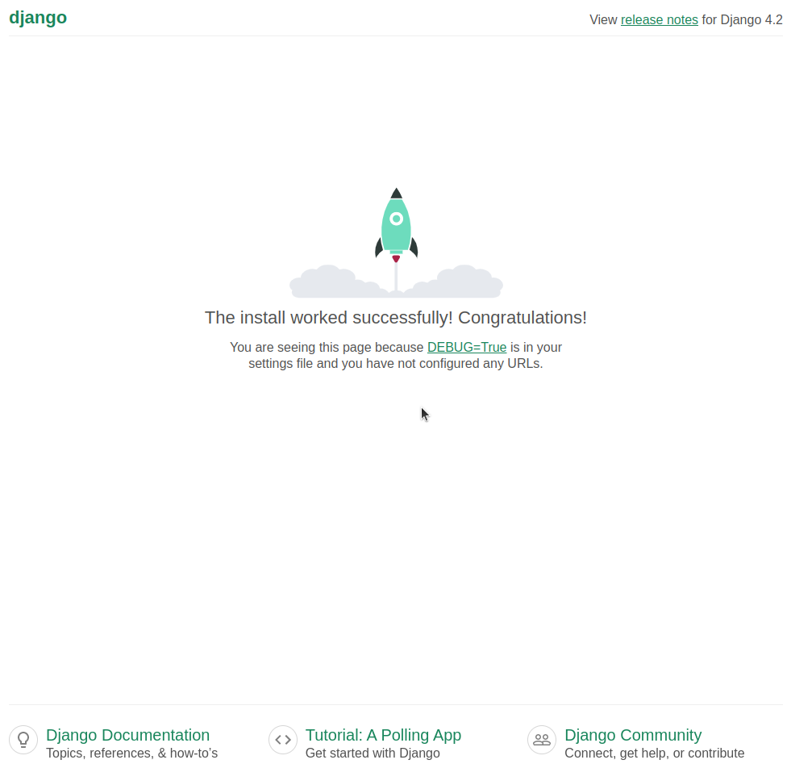

O Django inclui uma série de ferramentas auxiliares, que facilitarão o nosso desenvolvimento. Começaremos por uma ferramenta que cria os arquivos básicos do nosso projeto.

!!! exercise id_gera-projeto
    Utilize o comando a seguir para gerar a estrutura básica do projeto Django (note o ponto no final do comando):

    ```
    django-admin startproject getit .
    ```

Esse comando vai criar a estrutura do projeto chamado `getit` na pasta atual (`.`). Sua pasta conterá os seguintes arquivos:

```
pasta-do-projeto/
    .venv/
    getit/
        __init__.py
        asgi.py
        settings.py
        urls.py
        wsgi.py
    manage.py
```

Como já vimos, a pasta `.venv` contém todos os arquivos referentes ao ambiente virtual. Os outros arquivos são:

- `manage.py`: programa com [diversos comandos](https://docs.djangoproject.com/en/4.0/ref/django-admin/#available-commands) que automatizam tarefas relacionadas ao seu projeto Django.
- `getit/__init__.py`: esse é um arquivo vazio. O `__init__.py` é a forma de dizer para o Python que a pasta `getit` é um pacote. Se quiser saber mais, consulte a [documentação do Python](https://docs.python.org/3/tutorial/modules.html#tut-packages).
- `getit/settings.py`: as configurações do seu projeto estão concentradas neste arquivo. Para saber mais, consulte a [documentação do Django](https://docs.djangoproject.com/en/4.0/topics/settings/). Alguns exemplos: configuração do banco de dados, língua padrão da aplicação, localização das pastas de arquivos estáticos (CSS, JS, imagens, etc.).
- `getit/urls.py`: este arquivo define uma função para ser executada para cada rota da sua aplicação. Vamos falar mais sobre este conceito de **rotas** adiante.
- `getit/asgi.py` e `getit/wsgi.py`: arquivos utilizados para disponibilizar o seu projeto em um servidor (processo conhecido como "deploy").

!!! exercise id_testando-configuracao
    Vamos testar essa configuração inicial:

    ```
    python manage.py runserver
    ```

    Acesse a página em [`http://localhost:8000`](http://localhost:8000). Você deve ver uma página como a mostrada abaixo:

    

## Calma, mas eu nem escrevi código ainda!

Pois é, essa é uma das características desse tipo de framework. Muito do trabalho realizado por qualquer servidor web é bastante repetido:

1. Receber a requisição;
2. Processar a requisição para extrair as informações enviadas pelo cliente (ex: rota, parâmetros, etc.);
3. Construir a string de resposta;
4. Enviar a resposta para o cliente.

Além disso, várias outras tarefas são bastante comuns: verificar se existe um usuário associado àquela requisição, verificar se o usuário realmente é quem ele diz ser (autenticação), verificar se o usuário tem permissão para acessar aquela página/recurso específica, etc.

Todo esse trabalho repetido é executado pelo framework, no caso o Django, facilitando muito o desenvolvimento da aplicação. O que sobra para implementarmos é o que acontece depois que a requisição chegou no servidor e antes da resposta ser enviada para o cliente.

!!! exercise id_check-1
    Agora você já pode mostrar a página funcionando para algum professor. Faça o commit para receber o [Check 1](../checks.md).

Ainda precisamos de mais uma etapa de configuração e estaremos prontos para começar a olhar para o código. Essa também é uma característica do trabalho com frameworks: é comum ter uma etapa inicial de configuração. Siga para o [próximo passo](criando-app.md) para ver o que falta ser feito.
