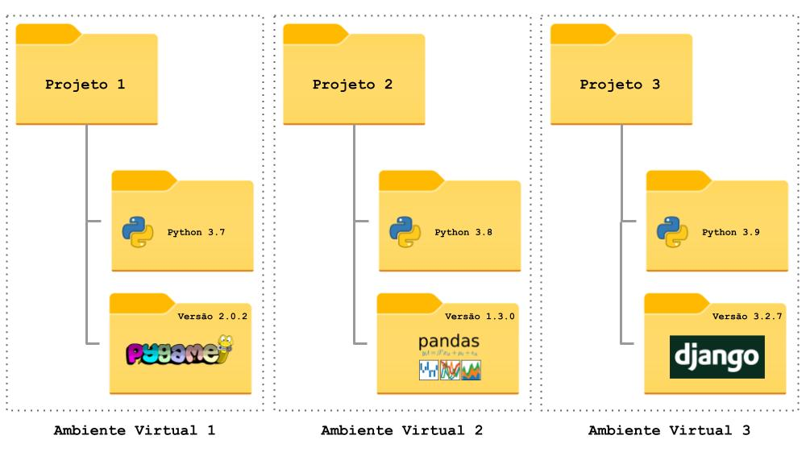
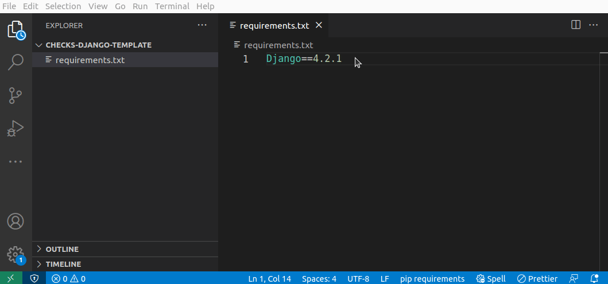

Assim como nos handouts de Pygame, também teremos um projeto a ser desenvolvido em paralelo com os handouts de Django. Esse projeto também possui checks, que devem ser validados com os professores para que você receba nota adicional nas provas de Django.

Comece criando o seu repositório do GitHub classroom acessando [este link](../checks.md).

Nesse repositório você pode encontrar um arquivo `requirements.txt`. Esse é um arquivo muito comum em projetos Python. Ele indica quais dependências (bibliotecas) devem ser instaladas para que o projeto possa ser executado.

## Venv

Cada novo projeto Python pode ter dependências diferentes. Nosso último projeto dependia do Pygame. Agora precisamos do Django. Nós poderíamos instalar todas essas dependências de uma vez para nunca mais precisarmos nos preocupar com isso. Mas será mesmo?

Linguagens de programação e bibliotecas (pacotes) evoluem ao longo do tempo. É muito importante que esta evolução aconteça: novas funcionalidades são adicionadas e bugs são corrigidos. A forma normalmente empregada para controlar esta evolução tecnológica é através da criação de versões para as linguagens de programação e bibliotecas. Por isso temos Python 2.7, Python 3.9, Python 3.11, e assim por diante.

No entanto, um efeito colateral desta evolução é que algo que funciona utilizando a versão 1 da biblioteca *X* pode não funcionar mais na versão 2 da mesma biblioteca.

Durante a graduação, os projetos são, na grande maioria, abandonados assim que você acaba o semestre. No mercado de trabalho você não poderá se dar a esse luxo: **projetos antigos são em geral mantidos por bastante tempo**. Assim, nem sempre o seu código vai funcionar com [a versão mais recente de todas as bibliotecas]()[^1]. Então é comum termos no mesmo computador projetos Python que utilizam versões diferentes de uma mesma biblioteca.

[^1]: É importante manter seu código atualizado com as versões mais recentes das bibliotecas, mas esse pode ser um processo bastante custoso. 

    Por exemplo, suponha que uma função de uma biblioteca utilizada pelo seu projeto passou a receber um argumento adicional em uma nova versão. Suponha também que essa função é utilizada em diversos lugares do seu código, que já possui milhares de linhas.

    Você precisará alterar todas as ocorrências da função no seu código, o que pode gerar novos bugs. Então você também precisará testar novamente o seu código e possivelmente realizar mais modificações e assim por diante. Enfim, atualizar a versão de uma dependência pode não ser tão simples, mas é importante, pois novas versões costumam trazer correções de bugs e vulnerabilidades.

Para resolver esse (e outros) problema, foram criados os ambientes virtuais (`venv`) do Python. Ele cria uma "nova instalação" do Python exclusiva para o seu projeto e os pacotes são instalados apenas nesse ambiente. Ou seja, quando você muda de projeto, basta mudar de ambiente virtual para usar uma instalação diferente, com um conjunto diferente de pacotes.



!!! info "Outras linguagens de programação"
    Todas as grandes linguagens de programação atuais possuem algum tipo de ferramenta desse tipo (algumas melhores, outras piores). Por exemplo, o NodeJS, não apenas faz o controle dos pacotes específicos de cada projeto, mas também avisa o desenvolvedor quando existe uma versão mais recente desses pacotes e sugere a atualização.

### Criando um venv para o nosso projeto

Vamos começar criando um venv para o nosso novo projeto. Além do Python, o ambiente também conterá uma versão do Django instalada. Para isso, temos duas opções: utilizar a linha de comando ou a interface do VS Code.

=== "VS Code"
    

    Com a pasta do projeto aberta:
    
    1. Aperte a tecla F1 e d
    2. Digite `python create environment`
    3. Selecione a opção `Venv`
    4. Escolha a versão do Python que quer utilizar (ex: 3.10)
    5. Marque a opção `requirements.txt`
    6. Aperte `Ok`

    O processo de criação do venv pode demorar alguns segundos até alguns minutos, dependendo de quantas dependências serão instaladas. A partir de agora, sempre que abrir o seu projeto no VS Code, será utilizado o Python do seu venv.

=== "Terminal Windows"
    Abra o terminal, na pasta do projeto, e digite os comandos a seguir:

    ```
    python3 -m venv .venv --prompt .
    . .venv\Scripts\Activate.ps1
    pip install -r requirements.txt
    ```

    **Importante:** sempre que abrir um novo terminal para executar o seu projeto você deve ativar o venv com o comando:

    ```
    . .venv\Scripts\Activate.ps1
    ```

=== "Terminal macos/Linux"
    Abra o terminal, na pasta do projeto, e digite os comandos a seguir:

    ```
    python3 -m venv .venv --prompt .
    . .venv/bin/activate
    pip install -r requirements.txt
    ```

    **Importante:** sempre que abrir um novo terminal para executar o seu projeto você deve ativar o venv com o comando:

    ```
    . .venv/bin/activate
    ```

!!! exercise id_criando-venv
    Crie o venv do seu projeto.

Agora que seu venv está criado e ativado, vamos [gerar a estrutura básica do projeto Django](gerando-estrutura-basica.md).
