# Deploy da Aplicação

Até agora você desenvolveu as suas aplicações e testou o servidor localmente. Neste handout vamos aprender como publicar a nossa aplicação para que qualquer pessoa com acesso à internet possa acessá-la. Existem diversas opções de hospedagem disponíveis. Alguns exemplos são a [Amazon AWS](https://aws.amazon.com/){:target="_blank"}, [DigitalOcean](https://www.digitalocean.com/){:target="_blank"}, [PythonAnywhere](https://www.pythonanywhere.com/){:target="_blank"}, [Linode](https://www.linode.com/){:target="_blank"}, [Heroku](https://www.heroku.com/){:target="_blank"} ...


## Crie uma conta

Vamos utilizar o serviço [Render](https://render.com){:target="_blank"} que oferece a opção gratuita para testarmos o seu serviço.

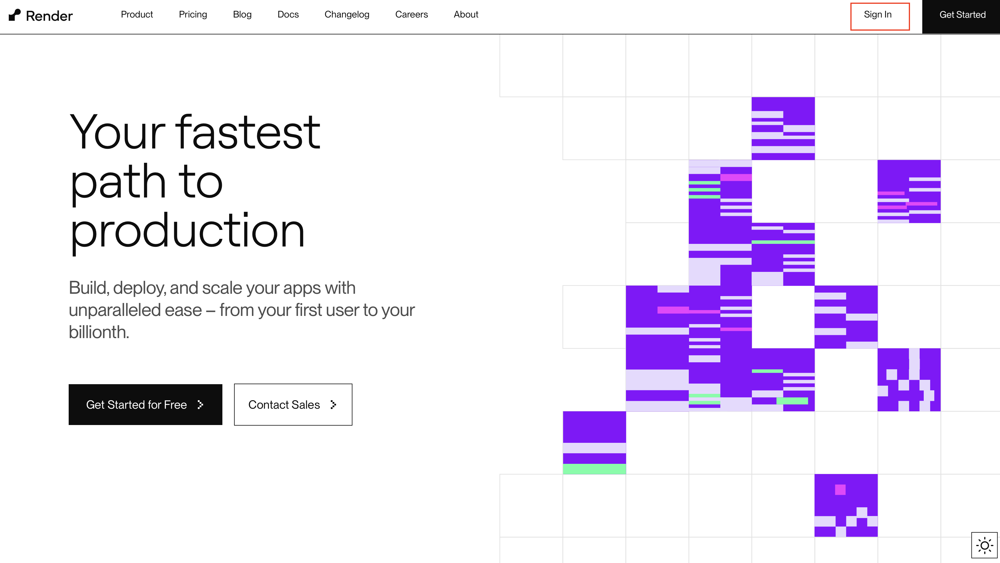{ width="70%" }


Crie a conta utilizando a conta do Github.

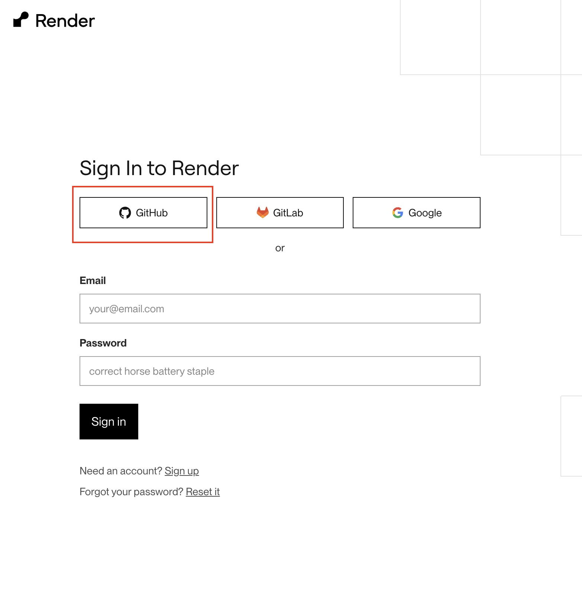{ width="60%" }


!!! danger "Importante"
    Não adicione/cadastre nenhum informação de pagamento.

## Projeto Exemplo

Para este handout, vamos utilizar um projeto exemplo que está disponível no repositório: [https://github.com/BarbaraTieko/projeto-exemplo.git](https://github.com/BarbaraTieko/projeto-exemplo.git){:target="_blank"}

Acesse o link do repositório e faça um fork do projeto.
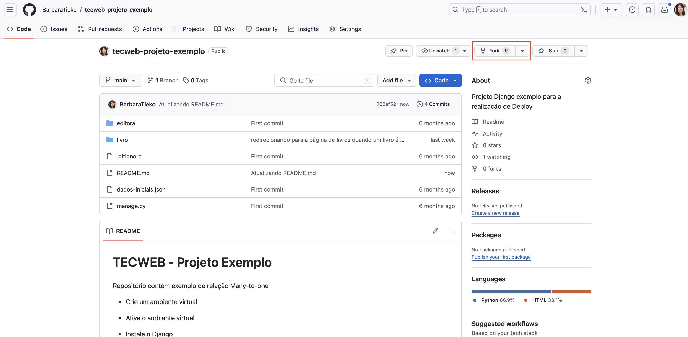{ width="100%" }

Ao realizar o fork, você terá uma cópia do projeto em seu repositório. Desta forma, você poderá realizar as alterações que desejar sem alterar o projeto original.

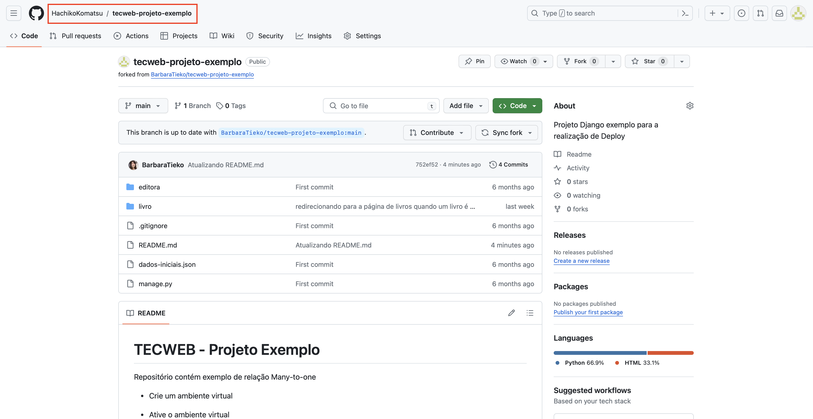{ width="100%" }

Clone o repositório que acabou de criar com o fork.

## PostgreSQL

Até o momento nós utilizamos o SQLite para as nossas operações com bancos de dados. O SQLite é um banco de dados leve e fácil de usar, porém não é adequado para um ambiente de produção. O PostgreSQL é um banco de dados relacional de código aberto e é uma das opções mais populares para aplicações web.

## Criando PostgreSQL no Render

Atualmente estamos testando a aplicação localmente em nosso computador.

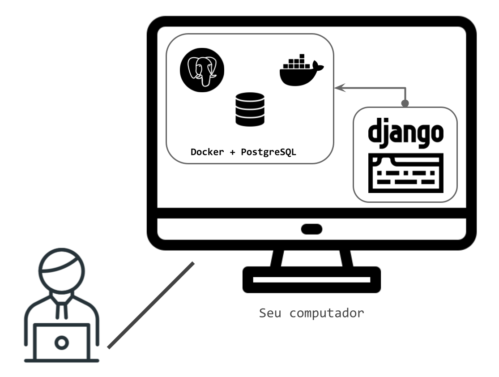{ width="60%" }

Para que a aplicação fique disponível para qualquer pessoa com acesso à internet, precisamos deixar nossa aplicação rodando 24 horas por dia. O nosso computador não é a melhor opção para isso. Para isso, vamos pegar emprestado um computador de uma empresa que oferece esse serviço. Neste handout vamos utilizar o `Render` que oferece uma opção gratuita para testarmos o seu serviço.

De modo geral, sistemas de bancos de dados são programas que ficam executando infinitamente. Um programa externo pode se conectar a esse programa para interagir com o banco de dados.

Desta forma, o primeiro passo é criar um banco de dados PostgreSQL utilizando o Render.

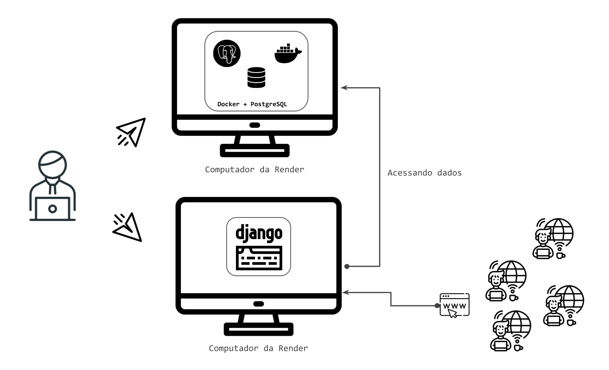{ width="80%" }

Visite o site [https://render.com/](https://render.com/){:target="_blank"} e escolha a opção `PostgreSQL`:


Preenche o campo `name` com um nome para o banco de dados. Os outros campos são opcionais.

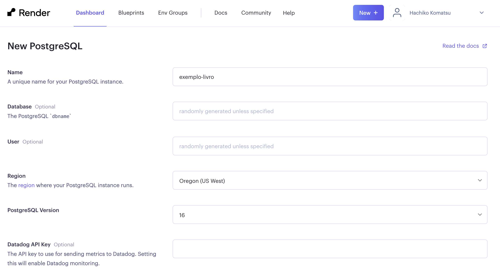

Escolha a opção gratuita. **Não é necessário adicionar nenhuma informação de pagamento.**
Em seguida, clique em `Create Database`.

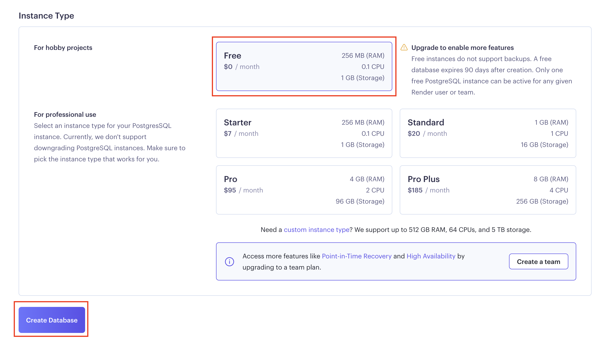

Será necessário esperar um pouco até que o banco de dados seja criado.

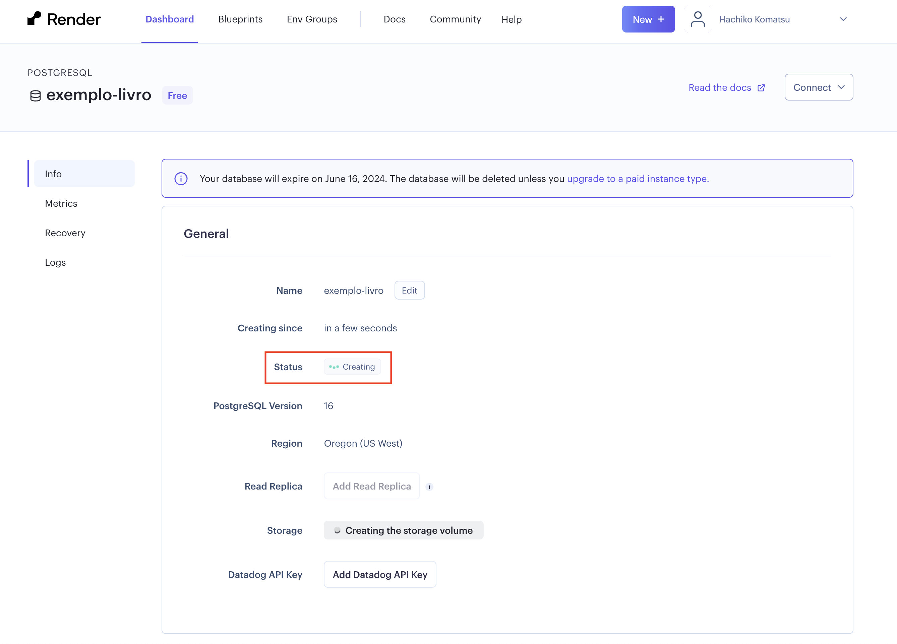

Quando o `status` estiver como `Available`, desça a página e procure a área chamada `Connections`. Dentro dessa área, procure o campo `External Database URL`, essa informação será utilizada para conectar o banco de dados com a aplicação. 

Clique no botão `Copy` e guarde essa informação, pois vamos precisar dela mais tarde. 

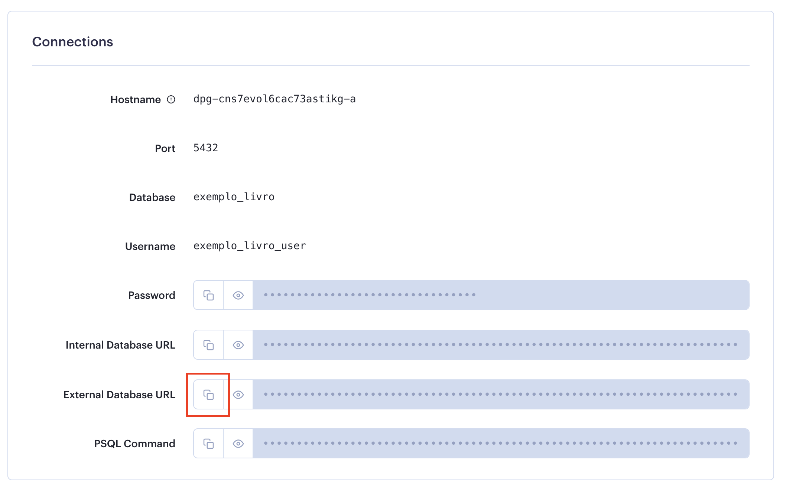

## Conectando a aplicação com o banco de dados PostgreSQL

A partir de agora, vamos fazer as modificações necessárias no projeto exemplo para que ele possa se conectar ao banco de dados PostgreSQL que acabamos de criar.

!!! info "Seu Projeto"
    Caso esteja realizando o handout com o seu projeto, crie uma branch chamada `deploy` e faça as modificações abaixo nessa branch. 

- Abra o projeto exemplo.
- Crie um ambiente virtual para este projeto e ative-o.
- No projeto há um arquivo chamado `requirements.txt` que contém todas as dependências necessárias para rodar o projeto. Vamos instalar todas as dependências com o comando:

    ```shell
    pip install -r requirements.txt
    ```

    !!! danger "Seu projeto"
        Caso esteja fazendo o handout em seu projeto, instale a biblioteca `psycopg2`.

        ```shell
        pip install psycopg2
        ```

- Para conectarmos a aplicação com o banco de dados PostgreSQL que acabamos de criar, vamos utilizar a biblioteca `dj-database-url`. Essa biblioteca é responsável por fazer a conexão entre a aplicação e o banco de dados. Para instalar essa biblioteca, execute o comando:

    ```shell
    pip install dj-database-url
    ```

    Sempre que você adiciona (ou remove) uma dependência é necessário atualizar o `requirements.txt`:
        ```shell
        pip freeze > requirements.txt
        ```

    Veja que o arquivo `requirements.txt` foi atualizado com a nova dependência.


- Adicione o `#!python import` no começo do arquivo `settings.py` (Pode ser logo após o código `#!python from pathlib import Path`):

```python
import dj_database_url
```

- Ainda no arquivo `settings.py`, procure pelo dicionário `#!python DATABASES` e substitua pelo código abaixo:
- No campo **default** adicione a informação aquela informação que havíamos copiado anteriormente. (O campo **External DATABASE URL**)

```python
DATABASES = {
    'default': dj_database_url.config(
        default='',
        conn_max_age=600,
        ssl_require=not DEBUG
    )
}
```


## Mais configurações do projeto

Até o momento, nós utilizamos o `python manage.py runserver` para executar o nosso servidor localmente. Esse comando é apropriado apenas para testes no ambiente de desenvolvimento. Ele não é otimizado para uma aplicação real. Para isso precisamos de um servidor de **Web Server Gateway Interface (WSGI)**, que basicamente é um intermediário entre as requisições que chegam no servidor e o código Python. No nosso projeto nós utilizaremos o [Gunicorn (Green Unicorn)](https://gunicorn.org/){:target="_blank"}. Você pode instalá-lo com (**importante:** lembre-se de ativar o ambiente virtual):

    pip install gunicorn

Será necessário atualizar o `requirements.txt`:
    ```shell
    pip freeze > requirements.txt
    ```

!!! info "O arquivo `wsgi.py`"
    O comando acima executou o Gunicorn com o arquivo de configuração `wsgi.py` que existe no projeto. Normalmente não é necessário alterar esse arquivo, então não vamos entrar em detalhes. O que você precisa saber é que todo projeto Django possui um arquivo `wsgi.py` dentro da pasta do projeto.

### Outras modificações nas configurações

Aproveite que está com o `settings.py` aberto e modifique o valor da constante `DEBUG` para `False`. Além disso, procure pela lista `ALLOWED_HOSTS`, ela deve ser uma lista vazia, ou seja, `ALLOWED_HOSTS = []` altere para:

```python
ALLOWED_HOSTS = ['*']
```

### Configurando os arquivos estáticos

Praticamente toda aplicação web possui arquivos estáticos. Desde o primeiro servidor que implementamos foi necessário que o servidor fosse capaz de responder com o conteúdo desses arquivos. Entretanto, passar pela camada do Python para devolver um arquivo estático não é uma boa estratégia para uma aplicação no mundo real. Arquivos estáticos podem ser servidos de maneira **muito** mais eficiente. Por esse motivo, o Django serve arquivos estáticos apenas em ambientes de teste/desenvolvimento, mas não em produção.

Para que a nossa aplicação funcione com todos os arquivos estáticos será necessário adicionarmos mais algumas dependências e alterarmos algumas configurações. Comece instalando o [WhiteNoise](http://whitenoise.evans.io/en/stable/){:target="_blank"}:

    pip install whitenoise

O WhiteNoise é responsável por servir arquivos estáticos no Django de forma eficiente. Ele precisa ser adicionado às configurações do Django. Abra o arquivo `settings.py` e procure pela lista chamada `MIDDLEWARE` e adicione o seguinte conteúdo logo depois de `'django.middleware.security.SecurityMiddleware',`:

    'whitenoise.middleware.WhiteNoiseMiddleware',

Nesse mesmo arquivo, procure por `STATIC_URL = '/static/'` e **adicione** a seguinte linha logo em seguida:

    STATIC_ROOT = BASE_DIR / 'staticfiles'

A primeira modificação faz com que o WhiteNoise seja utilizado pelo Django. A constante `STATIC_ROOT` define onde o Django deve colocar os arquivos estáticos que serão servidos em produção (por isso você não precisou dele até agora).

Como instalamos o `whitenoise` precisamos atualizar o `requirements.txt`. Desta forma, rode o comando abaixo novamente.

    pip freeze > requirements.txt

Caso o arquivo `requirements.txt` possua muitas dependências, talvez você tenha se esquecido de utilizar o ambiente virtual. Neste caso, ative o ambiente virtual e rode o comando `pip freeze > requirements.txt` novamente.

Se o arquivo possuir muitas dependências desnecessárias o deploy vai falhar.

### Faça commit e um push
Faça o commit das mudanças do seu projeto e faça um push para o seu repositório no Github.

**Importante:** Caso esteja realizando o handout com o seu projeto, faça um push para a branch `deploy`.

## Enviando o projeto para o Render

- Acesse a página do Render e clique em `New +` e em seguida `Web Service`.


    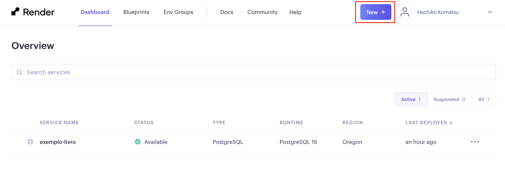


    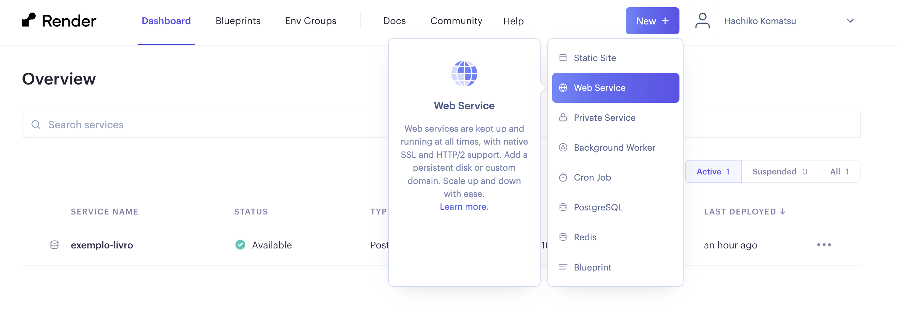


- Espere um pouco. Escolha a opção de fazer o deploy a partir de um repositório do Github. Procure o repositório que você fez o fork ou o repositório do seu projeto do projeto e clique em `Connect`.


    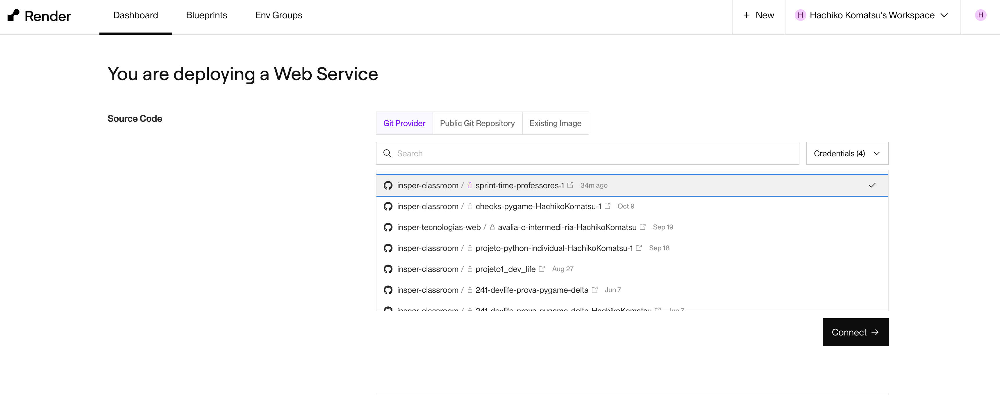

- Caso esteja trabalhando em seu projeto, selecione a branch `deploy`.

    

- Procure a opção `Start Command` e troque o comando existente pelo seguinte comando:

    ```shell
    python manage.py migrate && python manage.py collectstatic --noinput && gunicorn editora.wsgi:application
    ```


    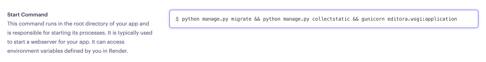


    Veja o que cada comando faz:

    - `python manage.py migrate` - Executa as migrações do banco de dados.
    - `python manage.py collectstatic` - Coleta todos os arquivos estáticos e os coloca na pasta `staticfiles`.
    - `gunicorn editora.wsgi:application` - Inicia o servidor com Gunicorn. Quando rodamos o comando `python manage.py runserver` o Django já inicia um servidor, mas para produção é necessário utilizar o Gunicorn.

    !!! danger "Importante"
        Ao tentar realizar este handout com o seu projeto, você deve alterar o comando `gunicorn editora.wsgi:application` para `gunicorn nome_do_seu_projeto.wsgi:application`.

    Caso queira que alguns escritores sejam criados automaticamente, adicione o comando `python manage.py loaddata dados-iniciais.json`. Este comando irá carregar os dados do arquivo `dados-iniciais.json` para o banco de dados. 

    Caso esteja realizando o handout com o projeto, o arquivo `dados-iniciais.json` deverá conter os dados iniciais que você deseja adicionar ao banco de dados.
    ```shell
    python manage.py migrate && python manage.py loaddata dados-iniciais.json && python manage.py collectstatic && gunicorn editora.wsgi:application
    ```

- Selecione a opção gratuita e clique em `Create Web Service`.


    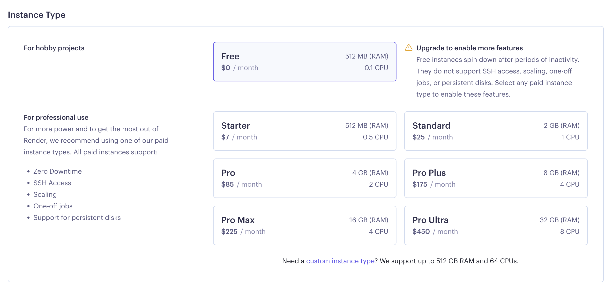

    
- O Render vai iniciar o processo de deploy. Aguarde até que o deploy seja finalizado. 
    É possível acompanhar o processo do deploy no terminal do Render. 


    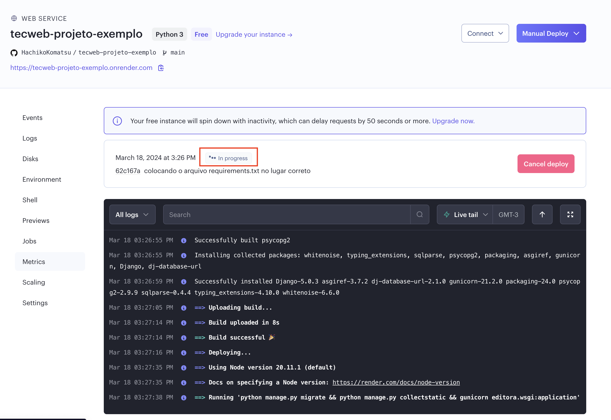


- Caso o deploy tenha sido realizado com sucesso, você verá a seguinte mensagem:


    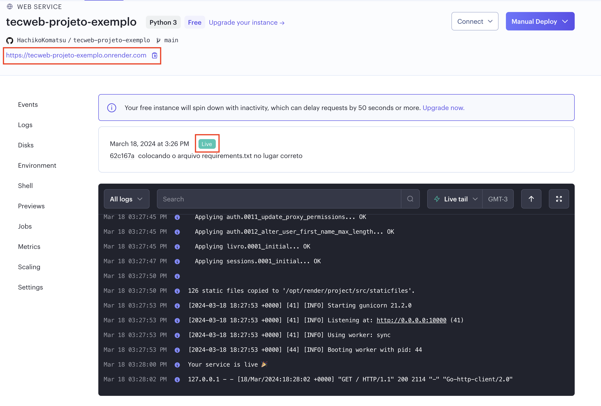


    É possível acessar a aplicação clicando no link que aparece no topo da página.

**Teste a aplicação!**

## Erros comuns

- Ao tentar realizar o deploy, você pode se deparar com alguns erros. Abaixo estão alguns erros comuns e como resolvê-los.
- Arquivo `requirements.txt` com muitas dependências desnecessárias.
- Caso o projeto esteja dentro de uma pasta é necessário alterar as configurações do Render para que ele consiga encontrar os arquivos do projeto.
- Muitos arquivos desnecessários sendo enviados para o Render.

## Passo final

Após realizar a etapa acima com sucesso, realize as últimas configurações.

Vá no arquivo `settings.py` e atualize a variável `ALLOWED_HOSTS` (A configuração da variável `ALLOWED_HOSTS` serve para evitar alguns ataques):

```python
ALLOWED_HOSTS = ['projeto-exemplo.onrender.com', 'localhost', '127.0.0.1', '0.0.0.0']
```
**Importante:** Para `ALLOWED_HOSTS` **não** deve utilizar o `https://`

Substitua `projeto-exemplo.onrender.com` pelo link da sua aplicação gerado pelo Render.

Faça um novo commit e realize um push para o seu repositório no Github.

Sempre que você realizar um commit na branch selecionada, o Render fará um novo deploy.

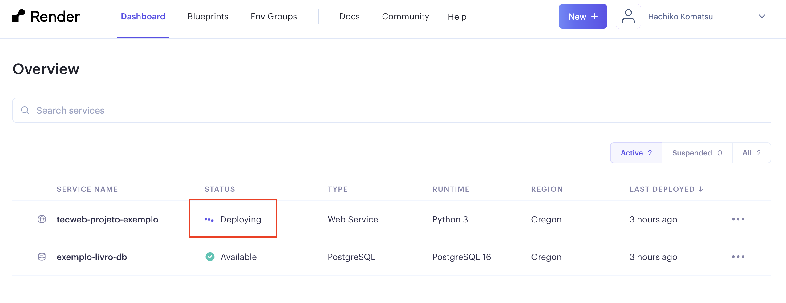

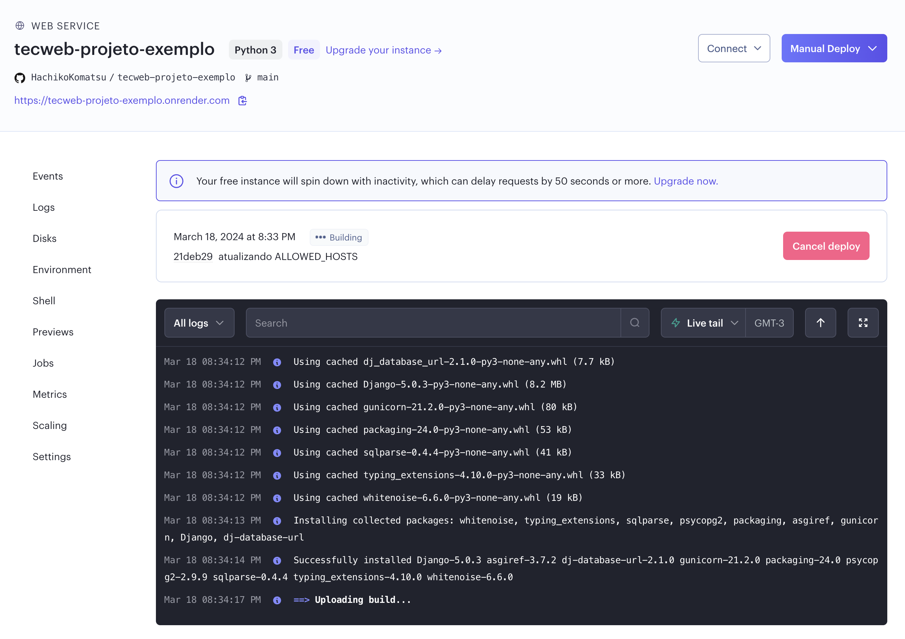


!!! example "Fazendo o deploy do seu Projeto"
    Agora que você finalizou o deploy do projeto exemplo, faça o deploy do Projeto.

    Como o serviço do Render é gratuito, talvez tenha que excluir as instâncias do banco de dados e do projeto da editora de livros que acabou de criar para que possa criar novas instâncias para o seu Projeto.

## Verifique se deu tudo certo

Ao chegar nesta etapa o Render já deve ter feito o deploy da sua aplicação. 

O Render deve ter gerado um link para a sua aplicação. Acesse o link e verifique se a aplicação está funcionando corretamente.

Caso tenha funcionado, você pode parar por aqui.

## Criando um usuário administrador

Na branch `deploy` do seu projeto, crie um `superuser` que terá acesso ao painel administrativo do Django. Para isso, execute o comando:

Como as configurações do banco de dados estão apontando para o banco de dados do Render, esse usuário será criado no banco de dados que criamos no Render.

### Carregando os dados iniciais 

Os dados inicias do seu projeto podem ser carregados com o comando `python manage.py loaddata dados-iniciais.json`, caso tenham criado um arquivo `.json` com os dados.

Esse comando pode ser adicionado ao comando de start do Render ou você pode executá-lo manualmente no seu terminal.

## Caso o seu projeto esteja trabalhando com armazenamento de imagens

Caso o seu projeto esteja trabalhando com armazenamento de imagens, você precisará de um serviço de armazenamento de arquivos. Vamos utilizar o serviço de armazenamento de arquivos da Amazon, o S3.

Para isso, vamos realizar as seguintes configurações:

- Instale a biblioteca `boto3` e `django-storages`:
    ```shell
    pip install boto3 django-storages
    pip install python-dotenv
    ```

- Atualize o arquivo `requirements.txt`:
    ```shell
    pip freeze > requirements.txt
    ```

- No começo do arquivo settings.py adicione o seguinte código para carregar as variáveis de ambiente do arquivo `.env` que vamos criar posteriormente:
    
    ```python
    import os
    from dotenv import load_dotenv
    load_dotenv()
    ```

- No arquivo `settings.py`, adicione `'storages',` na lista `INSTALLED_APPS`:

    ```python
    INSTALLED_APPS = [
        ...
        'storages',
    ]
    ```

- Ao final do arquivo `settings.py`, adicione as seguintes configurações e mude o valor da variável `nome_time` para o nome do seu time:

    ```python

    # ALTERE O VALOR DA VARIÁVEL nome_time PARA O NOME DO SEU TIME
    nome_time = '<NOME_DO_SEU_TIME>'
    STORAGES = {
        "default": {
            "BACKEND": "storages.backends.s3boto3.S3Boto3Storage",
            "OPTIONS": {
                "access_key": os.getenv("AWS_ACCESS_KEY_ID"),
                "secret_key": os.getenv("AWS_SECRET_ACCESS_KEY"),
                "bucket_name": os.getenv("AWS_STORAGE_BUCKET_NAME"),
                "region_name": os.getenv("AWS_S3_REGION_NAME"),
                "custom_domain": f'{os.getenv("AWS_STORAGE_BUCKET_NAME")}.s3.{os.getenv("AWS_S3_REGION_NAME")}.amazonaws.com',
                "querystring_auth": False,
            },
        },

        "staticfiles": {
            "BACKEND": "storages.backends.s3boto3.S3StaticStorage",
            "OPTIONS": {
                "access_key": os.getenv("AWS_ACCESS_KEY_ID"),
                "secret_key": os.getenv("AWS_SECRET_ACCESS_KEY"),
                "bucket_name": os.getenv("AWS_STORAGE_BUCKET_NAME"),
                "region_name": os.getenv("AWS_S3_REGION_NAME"),
                "custom_domain": f'{os.getenv("AWS_STORAGE_BUCKET_NAME")}.s3.{os.getenv("AWS_S3_REGION_NAME")}.amazonaws.com',
                "querystring_auth": False,
                'object_parameters': {
                    'CacheControl': 'max-age=86400',
                },
                'location': f'static/{nome_time}',
            },
        },


    }

    STATICFILES_STORAGE = 'django.core.files.storage.FileSystemStorage'

    MEDIA_URL = f'https://{os.getenv("AWS_STORAGE_BUCKET_NAME")}.s3.{os.getenv("AWS_S3_REGION_NAME")}.amazonaws.com/{nome_time}/'
    STATIC_URL = f'https://{os.getenv("AWS_STORAGE_BUCKET_NAME")}.s3.{os.getenv("AWS_S3_REGION_NAME")}.amazonaws.com/static/{nome_time}/'
    ```

- Na raiz do projeto Django, crie um arquivo chamado `.env`.

    !!! danger "Importante"
        O arquivo `.env` não deve ser commitado para o repositório. Certifique-se que o arquivo `.env` está no arquivo `.gitignore`.

    Adicione as seguintes variáveis no arquivo `.env`:

    ```shell
    AWS_ACCESS_KEY_ID = <ACCESS_KEY>
    AWS_SECRET_ACCESS_KEY = <SECRET_ACCESS_KEY>
    AWS_STORAGE_BUCKET_NAME =sprintsession242
    AWS_S3_REGION_NAME =us-east-2
    ```

- Os valores de `AWS_ACCESS_KEY_ID` e `AWS_ACCESS_KEY_ID` estão disponíveis no blackboard.
- Faça um commit e um push para o seu repositório no Github.
- No dashboard do Render, vá até o projeto e clique em `Edit Environment`.

    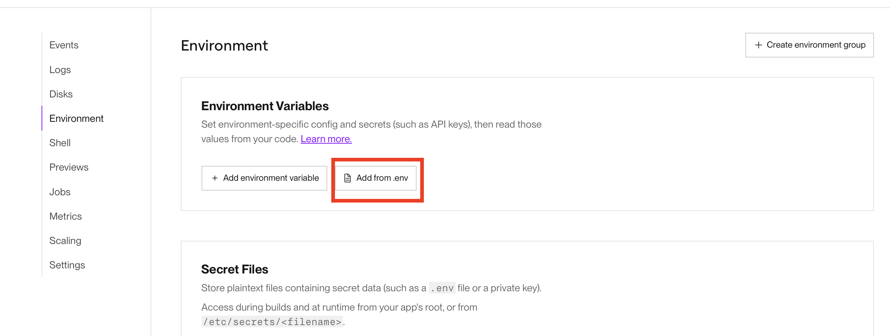

## Referências

- Deploy a Django web app to a Render live server with PostgreSQL - https://youtu.be/AgTr5mw4zdI?si=DNWuSTXZEu92XHZR
- Deploy Django com PostgreSQL - utilizando Free Trial Render https://youtu.be/hJuQb5L1Eq0
