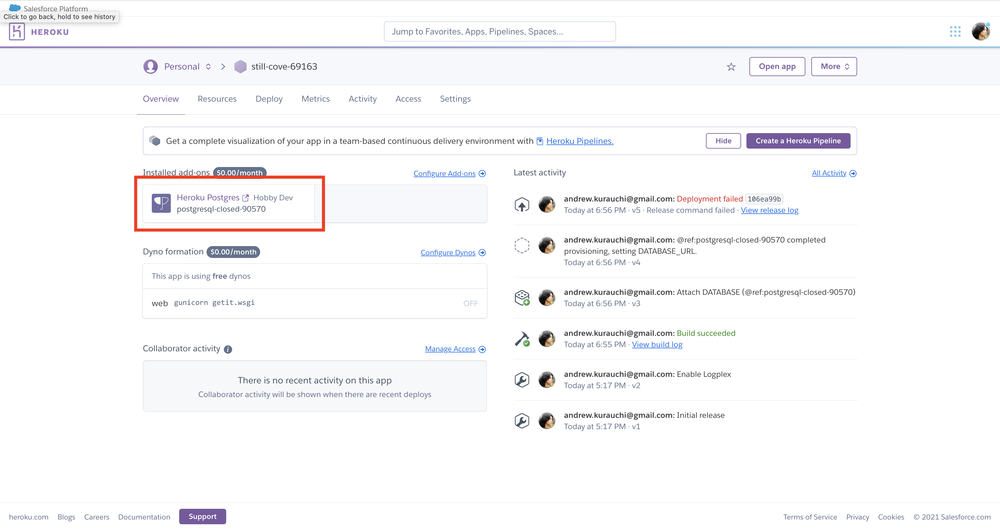

# Deploy da Aplicação

Até agora você desenvolveu as suas aplicações e testou o servidor localmente. Neste handout vamos aprender como publicar a nossa aplicação para que qualquer pessoa com acesso à internet possa acessá-la. Esse é o processo que chamamos de *deploy*. Existem diversas opções de hospedagem disponíveis. Alguns exemplos são a [Amazon AWS](https://aws.amazon.com/), [DigitalOcean](https://www.digitalocean.com/), [PythonAnywhere](https://www.pythonanywhere.com/), [Linode](https://www.linode.com/), ...

Cada um tem suas vantagens e desvantagens. Em DevLife nós utilizaremos o [Heroku](https://www.heroku.com/) pela facilidade de deploy de aplicações Python e por possuir uma conta gratuita para projetos pequenos. Se você preferir (ou quiser testar) qualquer outra opção, fique à vontade para utilizá-la.


## Primeiros passos

Para começar o processo de deploy, crie uma conta no [Heroku](https://www.heroku.com/).

Instale a interface de linha de comando (CLI) do Heroku: [Heroku CLI](https://devcenter.heroku.com/articles/heroku-cli#download-and-install).

Faça o login na sua conta do Heroku pelo terminal com o comando (você será redirecionado para a página do Heroku para completar o login):

    heroku login

Agora você pode criar uma aplicação utilizando o comando (a documentação dos comandos está [disponível aqui](https://devcenter.heroku.com/articles/heroku-cli-commands)):

    heroku create

Esse comando vai criar uma aplicação com nome aleatório e vai imprimir no terminal algo parecido com isso:

```
Creating app... done, ⬢ still-cove-69163
https://still-cove-69163.herokuapp.com/ | https://git.heroku.com/still-cove-69163.git
```

**No exemplo acima**, a aplicação se chama `still-cove-69163`. Guarde o nome da sua aplicação.

??? info "Criando uma aplicação com nome específico"
    Você pode escolher o nome da sua aplicação com o comando `heroku create nome-da-aplicacao`, mas ele precisa ser único **em todo o Heroku**, ou seja, ninguém pode ter criado um projeto com o mesmo nome.

Entre na pasta do seu projeto pelo terminal.


!!! danger "Importante"
    Seu projeto deve estar no git. Se não estiver, crie um repositório antes de seguir para os próximos passos deste handout.

    Quando for criar o repositório, adicione um arquivo chamado `.gitignore` com o seguinte conteúdo (se o arquivo já existir, adicione o conteúdo abaixo):

    ```
    env/
    *.egg-info
    *.pot
    *.py[co]
    .tox/
    __pycache__
    MANIFEST
    dist/
    docs/_build/
    docs/locale/
    node_modules/
    tests/coverage_html/
    tests/.coverage
    build/
    tests/report/
    ```

O deploy da aplicação é iniciado automaticamente a partir de atualizações em um repositório git do Heroku. Para configurar esse repositório no seu projeto, utilize o comando (**importante 1:** execute este comando na pasta raiz do seu projeto; **importante 2:** troque o `still-cove-69163` pelo nome do seu app gerado pelo Heroku):

    heroku git:remote -a still-cove-69163

Para confirmar se está tudo certo, utilize o comando:

    git remote -v

Ele deve listar (além de outros) os seguintes repositórios (claro, com o nome do seu app):

```
heroku	https://git.heroku.com/still-cove-69163.git (fetch)
heroku	https://git.heroku.com/still-cove-69163.git (push)
```

## Preparando o projeto

Até o momento, nós utilizamos o `python manage.py runserver` para executar o nosso servidor localmente. Esse comando é apropriado apenas para testes no ambiente de desenvolvimento. Ele não é otimizado para uma aplicação real. Para isso precisamos de um servidor de **Web Server Gateway Interface (WSGI)**, que basicamente é um intermediário entre as requisições que chegam no servidor e o código Python. No nosso projeto nós utilizaremos o [Gunicorn (Green Unicorn)](https://gunicorn.org/). Você pode instalá-lo com (**importante:** lembre-se de ativar o ambiente virtual):

    pip install gunicorn

Para testar sua aplicação com o Gunicorn, você pode executar o comando:


    gunicorn nome_da_pasta_do_seu_projeto.wsgi

!!! info "O arquivo `wsgi.py`"
    O comando acima executou o Gunicorn com o arquivo de configuração `nome_da_pasta_do_seu_projeto/wsgi.py`. Normalmente não é necessário alterar esse arquivo, então não vamos entrar em detalhes. O que você precisa saber é que todo projeto Django possui um arquivo `wsgi.py` dentro da pasta do projeto.


Acesse sua aplicação em [`localhost:8000`](http://localhost:8000) para verificar se está tudo funcionando até aqui. Depois que confirmar, pare o servidor (`ctrl+c`).

Agora vamos definir o arquivo de configuração do Heroku. Crie um arquivo chamado `Procfile` (o nome do arquivo não deve ter extensão nenhuma - cuidado se for criar o arquivo em algum editor de texto, pois alguns colocam o `.txt` automaticamente) na raiz do projeto com o seguinte conteúdo:

```
release: python manage.py migrate
web: gunicorn nome_da_pasta_do_seu_projeto.wsgi
```

!!! warning "Raiz do projeto"
    Para este tutorial é importante que a raiz do projeto seja a raiz do repositório git.

A primeira linha faz com que o comando de migração do Django seja executado quando o servidor for carregado. A segunda linha especifica como a aplicação deve ser executada.

!!! danger "Usuários Windows"
    Para realizar testes em desenvolvimento no Windows é necessário criar um arquivo adicional chamado `Procfile.windows` com o conteúdo:

    ```
    web: python manage.py runserver 0.0.0.0:5000
    ```

A partir de agora você pode testar sua aplicação com o comando (**importante:** a aplicação estará disponível na porta 5000 ao invés da 8000 que usamos até o momento, ou seja, [localhost:5000](http://localhost:5000)):

    heroku local

### Configurando os arquivos estáticos

Praticamente toda aplicação web possui arquivos estáticos. Desde o primeiro servidor que implementamos foi necessário que o servidor fosse capaz de responder com o conteúdo desses arquivos. Entretanto, passar pela camada do Python para devolver um arquivo estático não é uma boa estratégia para uma aplicação no mundo real. Arquivos estáticos podem ser servidos de maneira **muito** mais eficiente. Por esse motivo, o Django serve arquivos estáticos apenas em ambientes de teste/desenvolvimento, mas não em produção.

Para que a nossa aplicação funcione com todos os arquivos estáticos será necessário adicionarmos mais algumas dependências e alterarmos algumas configurações. Comece instalando o [WhiteNoise](http://whitenoise.evans.io/en/stable/):

    pip install whitenoise

O WhiteNoise é responsável por servir arquivos estáticos no Django de forma eficiente. Ele precisa ser adicionado às configurações do Django. Abra o arquivo `nome_da_pasta_do_seu_projeto/settings.py` e procure pela lista `MIDDLEWARE` e adicione o seguinte conteúdo logo depois de `'django.middleware.security.SecurityMiddleware',`:

    'whitenoise.middleware.WhiteNoiseMiddleware',

Nesse mesmo arquivo, procure por `STATIC_URL = '/static/'` e adicione a seguinte linha logo em seguida:

    STATIC_ROOT = BASE_DIR / 'staticfiles'

A primeira modificação faz com que o WhiteNoise seja utilizado pelo Django. A constante `STATIC_ROOT` define onde o Django deve colocar os arquivos estáticos que serão servidos em produção (por isso você não precisou dele até agora).

### Outras modificações nas configurações

Aproveite que está com o `settings.py` aberto e modifique o valor da constante `DEBUG` para `False`. Além disso, procure pela lista `ALLOWED_HOSTS`. Ela deve ser uma lista vazia. Por questões de segurança, o servidor Django aceita apenas requisições vindas de domínios previamente identificados. Para isso, descubra qual é o domínio do seu app Heroku. A URL do app será parecida com essa: `https://still-cove-69163.herokuapp.com/` (lembrando que `still-cove-69163` é o nome da minha aplicação, então você terá que trocar o começo pelo nome gerado para a sua aplicação). Adicione o domínio (o que está entre o `https://` e a última `/`) na lista `ALLOWED_HOSTS`:

```python
ALLOWED_HOSTS = ['still-cove-69163.herokuapp.com', 'localhost', '127.0.0.1']
```

Note que também adicionamos o `#!python 'localhost'` e o `#!python '127.0.0.1'`. Eles serão necessários para você testar a aplicação no seu computador.

### Criando o arquivo `requirements.txt`

Cada projeto Python possui dependências diferentes. Quando outra pessoa (ou você mesmo em outro computador) vai executar o seu projeto é necessário executar uma série de `pip install` com cada uma das dependências. Para simplificar esse processo podemos criar o arquivo `requirements.txt`. Com esse arquivo basta executar `pip install -r requirements.txt` para instalar todas as dependências do projeto. O Heroku também utiliza esse mesmo arquivo para configurar o seu projeto no servidor deles. O `requirements.txt` é basicamente um arquivo texto com a lista das dependências. Ele pode ser criado com o comando:

    pip freeze > requirements.txt

!!! danger "Importante"
    Verifique o conteúdo do arquivo `requirements.txt`. Se ele tiver muitas dependências que não parecem relacionadas ao seu projeto, é possível que você tenha gerado as dependências de outra instalação do Python. Apague o arquivo, ative o ambiente virtual e tente gerar o arquivo novamente.

    Depois de atualizar ou criar o `requirements.txt`, faça um novo commit.

## Fazendo o deploy

Agora estamos prontos para fazer o deploy! Faça um commit com todas essas modificações e depois faça o push com o comando a seguir:

    git push heroku main

!!! danger "Se o comando acima não funcionar"
    Tente rodar o comando:
    ```
    git push heroku master
    ```

Esse processo é um pouco demorado, pois o Heroku vai baixar o código da sua aplicação, aplicar as configurações e executar o servidor. Depois disso a sua aplicação está disponível no Heroku! Basta acessar o endereço do seu app.

!!! danger "Aplicações utilizando o SQLite"
    Se você não fez nenhuma alteração nas configurações do banco de dados, o seu app Django está utilizando um banco de dados chamado SQLite. 

    Apesar de ser mais fácil utilizá-lo, o Heroku pode apagar e subir uma nova instância da máquina que roda o seu servidor a qualquer momento. Quando ele faz isso, o arquivo do banco de dados é recriado e assim os seus dados são perdidos. Por esse motivo, o SQLite não deve ser utilizado em aplicações reais no Heroku.

### Aplicações com Postgres

Agora que você fez o primeiro deploy o Heroku identificou que você está publicando uma aplicação Django. Assim, ele já disponibiliza uma instância do Postgres para você! Acesse a sua aplicação no [dashboard do Heroku](https://dashboard.heroku.com/apps) e o Postgres deve aparecer nos add-ons instalados:



Uma opção é acessar os dados de configuração desse banco e alterar manualmente o dicionário `#!python DATABASES` nas configurações. Entretanto, isso faria com que o seu código parasse de funcionar em desenvolvimento (no seu computador). Por isso, vamos utilizar o `dj-database-url`. Também vamos precisar da biblioteca `psycopg2`:

    pip install dj-database-url
    pip install psycopg2-binary


Sempre que você adiciona (ou remove) uma dependência é necessário atualizar o `requirements.txt`:

    pip freeze > requirements.txt

Adicione o `#!python import` no `nome_da_pasta_do_seu_projeto/settings.py`:

```python
import dj_database_url
```

Depois substitua o dicionário `#!python DATABASES` por:

```python
DATABASES = {
    'default': dj_database_url.config(
        default=f'sqlite:////{(BASE_DIR / "db.sqlite3").absolute()}',
        conn_max_age=600,
        ssl_require=not DEBUG
    )
}
```

Faça um novo commit e dê o push em `heroku main` novamente. Acesse sua aplicação para verificar que está tudo funcionando.

Parabéns, você acaba de publicar sua aplicação Django no Heroku e já pode compartilhar com todos os amigos e familiares!

<div style="width:100%;height:0;padding-bottom:74%;position:relative;"><iframe src="https://giphy.com/embed/vmon3eAOp1WfK" width="100%" height="100%" style="position:absolute" frameBorder="0" class="giphy-embed" allowFullScreen></iframe></div><p><a href="https://giphy.com/gifs/celebration-excited-loki-vmon3eAOp1WfK"></a></p>

## Referências

- Deploying to Heroku Server | Django (3.0) Crash Course Tutorials (pt 23): https://www.youtube.com/watch?v=kBwhtEIXGII
- Deploy a Django App to Heroku: https://www.youtube.com/watch?v=GMbVzl_aLxM
- Heroku Postgres - connecting with Django: https://devcenter.heroku.com/articles/heroku-postgresql#connecting-with-django
- Heroku - Django migrations: https://help.heroku.com/GDQ74SU2/django-migrations
- Heroku - Working with Django: https://devcenter.heroku.com/categories/working-with-django