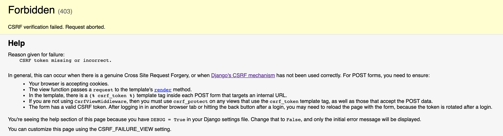

Existem muitos detalhes do que acontece por baixo dos panos que ainda não contamos para você. Um deles é que existe mais uma informação importante na requisição HTTP além da URL (que nos informa o endereço, porta e caminho): o verbo HTTP.

Até o momento estamos pensando em requisições que **solicitam uma informação** (a página HTML) ao servidor. Agora, porém, queremos criar uma nova anotação e para isso precisamos **enviar informações** para o servidor. Essa "intenção" é indicada em uma requisição usando um marcador conhecido como verbo HTTP. Quando queremos solicitar uma informação, usamos o verbo **"GET"**. Quando queremos enviar uma informação, usamos o verbo **"POST"**.

Quando digitamos o endereço de uma página no navegador, ou clicamos em um link, o navegador faz uma requisição do tipo GET: ele quer receber uma página HTML do servidor. Agora queremos enviar para o servidor os dados da nova anotação a ser criada. Por isso, usaremos o método POST.

!!! exercise id_form-com-post
    Modifique a tag `#!html <form>` do seu template para:

    ```html
    <form method="post" action="/">
    ```

Os dois atributos adicionais são:

- `#!html method="post"`: indica para o navegador que quando o formulário for submetido, a requisição deve utilizar o método `POST`;
- `#!html action="/"`: indica para o navegador que quando o formulário for submetido, a requisição deve ser enviada para o caminho `/`. Como o endereço atual já está nesse mesmo caminho, este atributo seria desnecessário, mas usamos a oportunidade para apresentar essa funcionalidade, caso você precise fazer um POST para um caminho diferente.

!!! exercise choice id_submit-sem-csrf
    Aperte o botão de submissão do formulário na sua página. Qual erro ocorreu?

    - [x] `Forbidden (403) CSRF verification failed.`
    - [ ] `Forbidden (403) You do not have access to this page.`
    - [ ] `Not Found (404) Page not found.`
    - [ ] `Not Found (404) This page does not exist.`
    - [ ] Não ocorreu nenhum erro
  
    !!! answer
        Uma página como a mostrada abaixo deve ter aparecido. Já veremos o que significa esse erro.

        

## O ataque CSRF

O [*Cross Site Request Forgery*](https://docs.djangoproject.com/en/4.0/ref/csrf/) é um tipo de ataque no qual um site malicioso utiliza um link/form/javascript para submeter dados utilizando um usuário logado no seu sistema. Para se proteger desse tipo de ataque, todos os formulários do seu sistema devem enviar, através de um [campo escondido](https://www.w3schools.com/tags/att_input_type_hidden.asp), um token gerado pelo servidor. Assim, o servidor saberá que a requisição foi feita por um cliente confiável.

Isso pode soar complexo, mas basta inserir uma template tag no seu formulário. O Django cuida do resto.

!!! exercise id_adiciona-csrf-token
    Adicione uma nova linha logo abaixo da abertura da tag `#!html <form>` com a tag: ``

    Tente submeter seu formulário novamente. O efeito esperado é que a página apenas "recarregue".

Sabemos que o caminho vazio (`/`) é mapeado para a view `index`. Vamos modificá-la um pouco para vermos [como essa informação é recebida](recebendo-post.md).
