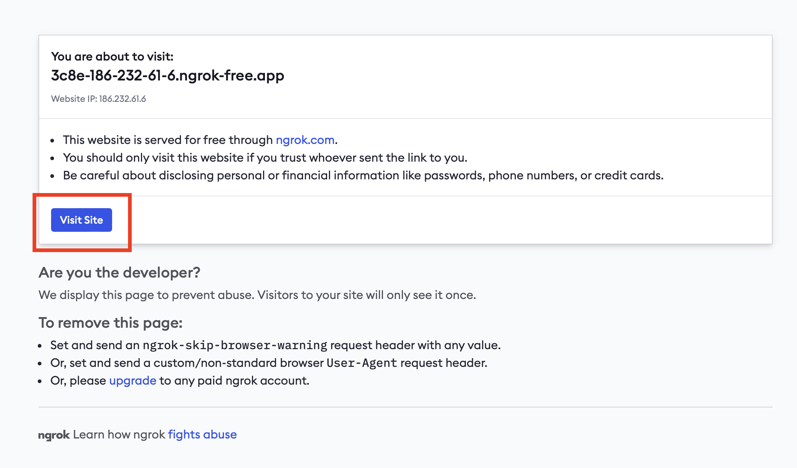

# Ngrok

O Ngrok é uma ferramenta que permite criar túneis seguros para a sua máquina local. Túneis são úteis para expor serviços locais para a internet, como APIs REST, servidores web, etc.

## Instalação

Para instalar o Ngrok, acesse o [site oficial](https://ngrok.com/download) e faça o download da versão compatível com o seu sistema operacional.

## Utilização

- Execute o comando `ngrok http 8000`, caso esteja utilizando outra porta, substitua o `8000` pela porta do seu projeto.

Ao rodar o comando acima, o Ngrok irá gerar um link que pode ser acessado de qualquer lugar. 

- Troque o link `5fa7-179-113-114-209.ngrok-free.app` pelo link gerado pelo Ngrok.

- Substitua a linha com a variável `ALLOWED_HOSTS` no arquivo `settings.py` do seu projeto pelo código abaixo.

**Importante**: O link deve estar sem o `http://` ou `https://`.

```python
ALLOWED_HOSTS = ['5fa7-179-113-114-209.ngrok-free.app', 'localhost', '127.0.0.1', '0.0.0.0']
```

- Ainda no arquivo `settings.py`, adicione o código abaixo:

Lembre-se de substituir o link pelo gerado pelo Ngrok. Nesta etapa, é necessário adicionar o `https://`.

```python
CSRF_TRUSTED_ORIGINS = ['https://5fa7-179-113-114-209.ngrok-free.app']
```

- Deixe seu projeto rodando localmente. 

- Tente acessar o link gerado no seu celular, por exemplo.

    Ao acessar o link gerado pelo Ngrok, você verá a tela de permissão para acessar o site. Clique em `Visit Site`.

    

- Com esse link, você poderá utilizar para o teste na sala de usabilidade com Eye Tracker.

!!! note "Importante"
    Sempre que você parar a execução do Ngrok, o link gerado será perdido e você precisará gerar um novo link.


