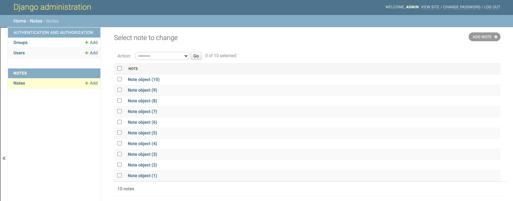
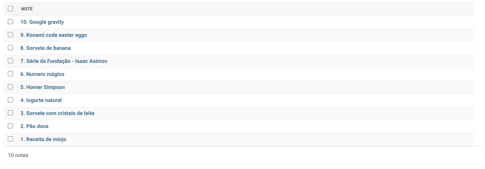

É comum precisarmos criar um site específico para gerenciar (adicionar, remover, editar) os conteúdos da nossa página. Em geral, essas páginas de administração não precisam ser particularmente bonitas ou criativas. Assim, o Django disponibiliza uma interface de administração criada automaticamente.

Para ter acesso a essa página vamos precisar criar um usuário administrador. Execute no terminal o comando a seguir e siga os passos para criar o seu usuário:

```
python manage.py createsuperuser
```

Agora execute o servidor:

```
python manage.py runserver
```

E acesse a página de administração em [`http://localhost:8000/admin/`](http://localhost:8000/admin/). Ela ainda não possui muitos recursos, mas você já poderia criar usuários manualmente a partir dessa interface.

## Você me enganou... onde está a interface do app notes?

Calma, foi só uma meia verdade. A criação da interface de administração não é 100% automática. Mas você vai ver que precisamos de muito pouco código.

!!! exercise
    Abra o arquivo `notes/admin.py` e substitua o seu conteúdo por:

    ```python
    from django.contrib import admin
    from .models import Note


    admin.site.register(Note)
    ```

    Agora sim, entre novamente na página de admin (não precisa nem reiniciar o comando `runserver` - ele já faz isso automaticamente).

Se quiser saber mais sobre o Django Admin, [consulte a documentação](https://docs.djangoproject.com/en/4.2/ref/contrib/admin/).

!!! exercise
    Utilize o Django Admin para criar algumas anotações.

Depois de adicionar algumas anotações, a sua lista deve estar mais ou menos assim:



Não sei para você, mas para mim esses nomes `Note object (x)` não parecem muito úteis. Seria melhor se ele mostrasse o título da anotação. A boa notícia é que você pode modificar o que aparece na lista da página de admin. Para mostrar um objeto qualquer, por exemplo `note`, na interface, ele utiliza a função `#!python str` para transformar o objeto em uma string (`#!python str(note)`). Nós podemos modificar essa funcionalidade sobrescrevendo [o método `#!python __str__()`](https://docs.python.org/3/reference/datamodel.html#object.__str__).

!!! exercise
    Implemente o método `#!python __str__(self)` na classe `#!python Note`. Ele deve devolver uma string no seguinte formato: `ID. TITULO`, onde `ID` é o [id do objeto](https://docs.djangoproject.com/en/4.2/topics/db/models/#automatic-primary-key-fields) e `TITULO` é o título do objeto (atributo `title`).

    Depois de implementar esse método, a lista de anotações na tela de admin deve estar mais ou menos assim:

    

!!! exercise id_check-2
    Agora que você já adicionou algumas anotações ao banco de dados, o Check 2 deve estar completo. Faça o commit e mostre para algum professor para validar [este check](../checks.md).

A interface do Django Admin já permite a realização de diversas operações, mas provavelmente não é o que queremos apresentar para o usuário final do nosso sistema. Para termos mais liberdade de implementar o design e lógicas mais personalizadas, vamos precisar trabalhar com urls e views, mas antes disso, vamos [voltar ao nosso diagrama inicial](revisao.md).
