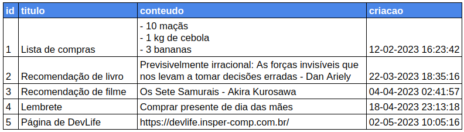

Nos handouts a seguir, você construirá um sistema web para realizar anotações curtas chamado Get-it. Nesse sistema, o usuário será capaz de adicionar, ler, editar e remover suas anotações. Cada anotação possuirá um título e um conteúdo formado exclusivamente por texto.

Uma etapa importante no desenvolvimento de um sistema é a modelagem dos dados. Devemos refletir sobre quais dados queremos armazenar no banco de dados e como eles devem ser organizados. Em DevLife não vamos nos aprofundar nessa discussão, mas em semestres futuros você terá disciplinas nas quais aprenderá quais aspectos devem ser levados em conta nessa etapa do desenvolvimento. O que você precisa saber por enquanto é que nos bancos de dados que utilizaremos, as informações são armazenadas em tabelas. Por exemplo, os nossos dados de anotações poderiam ser armazenados em uma tabela como esta:



Note que a primeira coluna, o `id`, possui um número associado, que aumenta a cada linha. Em bancos de dados é comum que as linhas de uma tabela possuam um identificador numérico. Isso facilita o acesso à informação e também pode ser utilizado para criar relações entre tabelas, mas isso é assunto para um handout futuro.

## O arquivo `models.py`

Bancos de dados são sistemas bastante complexos, com diversas travas de segurança e otimizações. Por esse motivo, a grande maioria dos frameworks não cria um banco de dados próprio, mas se conecta a um banco de dados externo.

O Django possui diversas funcionalidades relacionadas a banco de dados. Para utilizá-las, devemos implementar classes que herdam do tipo `django.db.models.Model`. Cada **classe de modelo** que implementarmos será mapeada em uma **tabela** do banco de dados pelo Django. Nesse primeiro momento, não precisamos nos preocupar com os detalhes de como isso acontece.

!!! exercise id_estudo-sobre-heranca
    Faça o handout sobre [herança](../../python/intermediario/classes/heranca.md) e depois retorne para este handout.

Nas classes de modelo, devemos definir quais são os **nomes** e **tipos** das colunas que serão armazenadas na tabela do banco de dados. A seguir definimos uma classe [`#!python Note`]()[^1] para representar uma anotação no banco de dados:

[^1]: Em computação é comum escrevermos o código em inglês. Apesar de não ser um requisito, isso pode ser útil principalmente se existir a possibilidade de algum programador que fala outra língua encontrar o seu código. Um exemplo disso são os códigos dos seus projetos no GitHub. Manter os códigos em inglês nos seus projetos abertos no GitHub pode render até possíveis empregos no exterior.

```python
from django.db import models

class Note(models.Model):
    title = models.CharField(max_length=200)
```

Para entender o que esse código faz, vamos consultar a boa e velha documentação. O Django é um projeto muito maior e mais utilizado do que o Pygame. Portanto, a sua documentação é muito mais completa - você pode encontrar diversos exemplos de uso e explicações detalhadas de cada funcionalidade.

!!! exercise short id_l2l_docs_charfield
    Consulte a [documentação do `#!python django.db.models.CharField`](https://docs.djangoproject.com/en/4.2/ref/models/fields/#charfield) e escreva em uma frase o que ele faz.

    !!! answer
        O `#!python django.db.models.CharField` é uma classe que representa um campo (coluna do banco de dados) do tipo texto. Ele pode receber um argumento `#!python max_length` para indicar o número máximo de caracteres que serão armazenados nessa coluna.

Assim, a classe `#!python Note` definida acima, possui uma coluna chamada `#!python title` que armazena strings de no máximo 200 caracteres.

!!! exercise short id_l2l_docs_campo_conteudo
    Após realizar uma consulta na internet, você descobriu que existem alguns tipos possíveis para colunas do tipo string em Django:

    - [`#!python django.db.models.CharField`](https://docs.djangoproject.com/en/4.2/ref/models/fields/#charfield)
    - [`#!python django.db.models.SlugField`](https://docs.djangoproject.com/en/4.2/ref/models/fields/#slugfield)
    - [`#!python django.db.models.TextField`](https://docs.djangoproject.com/en/4.2/ref/models/fields/#textfield)
    - [`#!python django.db.models.URLField`](https://docs.djangoproject.com/en/4.2/ref/models/fields/#urlfield)

    Leia a documentação de cada um desses tipos e decida qual é a mais adequada para armazenar o *conteúdo* de uma anotação. Escreva uma frase justificando sua resposta.

    !!! answer
        O tipo `#!python django.db.models.TextField` é recomendado para o armazenamento de textos grandes. Esse tipo pode ser mais adequado para o nosso caso de uso, pois assim podemos possibilitar ao usuário que escreva conteúdos mais longos.

        Não existe necessariamente uma resposta certa. Essa é uma decisão que depende do design.

!!! exercise short id_l2l_docs_campo_criacao
    Em mais uma consulta na internet, você descobriu 2 candidatos para o campo *criação* da anotação. Lembre-se que essa informação armazena o dia e horário de criação da anotação. Leia a documentação dos dois campos e escreva abaixo qual é o mais apropriado e por que.

    - [`#!python django.db.models.DateField`](https://docs.djangoproject.com/en/4.2/ref/models/fields/#datefield)
    - [`#!python django.db.models.DateTimeField`](https://docs.djangoproject.com/en/4.2/ref/models/fields/#datetimefield)

    A [documentação do módulo `datetime`](https://docs.python.org/3/library/datetime.html#available-types) do Python pode ser útil.

    !!! answer
        Como queremos armazenar a informação de horário, devemos utilizar o `#!python django.db.models.DateTimeField`.

!!! exercise short id_l2l_docs_datetimefield_auto_now_add
    Queremos que o campo de *criação* seja atualizado com o horário atual no momento da criação de uma anotação. Você descobriu que o Django já possui um recurso para preencher esse valor automaticamente, mas está em dúvida de qual deve utilizar. 
    
    Leia a documentação dos argumentos opcionais para decidir qual faz o que você quer. Escreva abaixo sua resposta.

    !!! answer
        O argumento `#!python auto_now_add` deve ser `#!python True`. É comum ficarmos em dúvida entre esse argumento e o `#!python auto_now`, que é atualizado com o horário atual **sempre que o objeto é salvo** (o que inclui edições aos dados).

### E o ID?

Na tabela mostrada no início da página havia 4 colunas: `id`, `titulo`, `conteudo` e `criacao`. Já vimos como criar as colunas de título e conteúdo, mas em nenhum momento criamos a coluna de id. E não vamos precisar criar. Como todo modelo do banco de dados precisa ter um id, o Django já cria essa coluna automaticamente. Assim não precisamos nos preocupar com ela durante a definição da classe.

!!! exercise id_modelo-com-varios-campos
    Para conhecer os tipos de campos disponíveis para os modelos e praticar a criação de classes de modelos, faça o exercício ["Criando alguns modelos"](../exercises/criando_modelos/index.md).

!!! exercise id_modelo-Note
    Implemente a classe `#!python Note` no arquivo `#!python models.py` seu projeto. Ela deve possuir 3 campos (colunas): o título (`#!python title`), o conteúdo (`#!python content`) e a data e horário de criação (`#!python created_at`).

Nosso primeiro modelo está pronto! Mas ainda falta [um passo](migracoes.md) para podermos usá-lo no nosso sistema :cry:.
