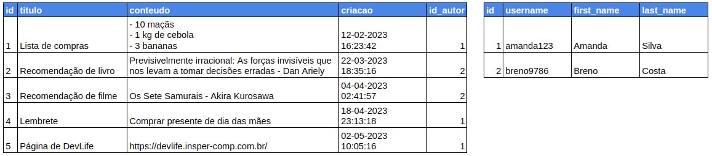

Nós já aprendemos a [criar classes de modelos](../primeiro-modelo/index.md) que representam os dados no banco de dados. Uma limitação, entretanto, é que ainda não sabemos como relacioná-los. Por exemplo: temos uma classe `#!python Note` representando uma anotação e uma classe `#!python User` representando um usuário (esse modelo é definido no app de autenticação), mas não sabemos como salvar no banco de dados a informação de que um determinado usuário criou/é o dono de uma determinada anotação.

Em bancos de dados baseados em tabelas (chamados bancos de dados relacionais) como os que estamos usando, implementam esse tipo de relacionamento usando os id's. Por exemplo:



Nas tabelas acima, a última coluna da tabela de anotações (`id_autor`) indica o relacionamento entre uma anotação e um usuário. Nesse caso, a Amanda é autora da 1a, 4a e 5a anotações, enquanto o Breno é o autor da 2a e 3a anotações. Essa ideia de usar o id para apontar para uma linha de outra tabela é conhecido no contexto de bancos de dados como **"chave estrangeira"**, pois é uma chave (id) de outra tabela.

No Django existem campos/colunas especificos para representar esse tipo de relacionamento. Neste handout, vamos nos focar no campo [`django.db.models.ForeignKey`](https://docs.djangoproject.com/en/4.2/ref/models/fields/#django.db.models.ForeignKey).

!!! exercise id_campo-autor
    Adicione no seu modelo `#!python Note` o campo abaixo:

    ```python
    author = models.ForeignKey("auth.User", on_delete=models.CASCADE)
    ```
    
    O primeiro argumento é o nome da classe de modelo para o qual queremos fazer a referência. O segundo argumento será discutido no exercício a seguir.

!!! exercise id_l2l-on_delete
    Antes de testarmos, leia a [documentação do `#!python ForeignKey`](https://docs.djangoproject.com/en/4.2/ref/models/fields/#django.db.models.ForeignKey.on_delete) para entender o que significa o argumento `#!python on_delete`. Escreva em uma ou duas frases para que esse argumento é utilizado.

    !!! answer
        O argumento `#!python on_delete` indica para o Django o que fazer caso o objeto referenciado (no nosso exemplo, o usuário) for removido do banco de dados. Isso é importante, pois caso o Django não faça nada, os dados do banco de dados estarão inconsistentes, pois não existirá o usuário apontado pela chave estrangeira.

!!! exercise id_migracoes
    Sempre que modificamos nossos modelos, é necessário gerar e aplicar as migrações. Vamos fazer esse processo. Se não se lembrar os comandos (isso é normal, você acabará decorando se usar muitas vezes), consulte o [primeiro handout sobre modelos](../primeiro-modelo/migracoes.md).

    Execute o comando `python manage.py makemigrations`. É esperado que apareça uma mensagem como esta:

    ```
    It is impossible to add a non-nullable field 'author' to note without specifying a default. This is because the database needs something to populate existing rows.
    Please select a fix:
    1) Provide a one-off default now (will be set on all existing rows with a null value for this column)
    2) Quit and manually define a default value in models.py.
    Select an option:
    ```

    Essa mensagem apareceu porque acabamos de criar um novo campo `#!python author`, mas é possível que já existam anotações no banco de dados. Qual deve ser o valor da nova coluna `#!python author` nessas anotações? É isso o que o Django está perguntando.

    Digite `1` e aperte `Enter`.

    Isso fará com que o usuário de id `1` seja adicionado como autor de todas as anotações que estiverem no banco de dados.

    Agora sim você pode aplicar as migrações. Abra o Django Admin e acesse os dados de alguma anotação. Verifique que o usuário de id `1` (provavelmente o admin) está marcado como autor.

!!! exercise id_adiciona-autor
    Modifique o seu código de criação de anotações no arquivo `notes/views.py` para que o `#!python author` das anotações seja o usuário logado (`#!python request.user`).

    Crie mais alguns (pelo menos 1) usuário pelo Django Admin e teste essa funcionalidade. O Django Admin deve mostrar o usuário que estava logado no momento da criação da anotação como o seu autor.

Agora que temos a informação do autor, vamos aprender a [filtrar anotações](fazendo-queries.md) para mostrar apenas aquelas que pertencem ao usuário logado.
