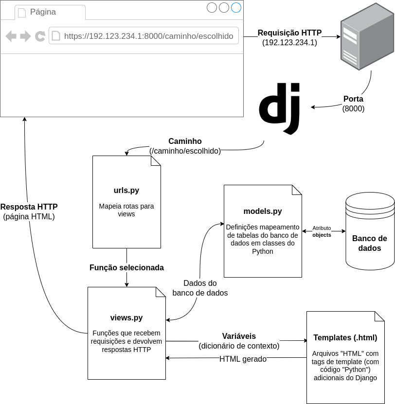

Agora já passamos pelo básico de todo o nosso diagrama:



O arquivo `urls.py` é usado basicamente para selecionar qual função de view será chamada, mas a maior parte do nosso código está dividida entre views, classes de modelos e templates. Essa divisão de responsabilidades é conhecida como arquitetura MVT no Django (*Model-View-Template*): a view implementa a lógica de negócios, o modelo implementa a interação com o banco de dados e o template implementa a visualização da página a partir dos dados do contexto.

!!! exercise parsons no-indent id_ordem-dos-acontecimentos
    Mova as linhas para o bloco da direita, colocando-as em ordem de acontecimento (suponha que o caminho `''` está associado à view `#!python views.index`).

    ```text
    Navegador faz requisição para a URL http://localhost:8000/
    Django procura o padrão "" no arquivo urls.py
    Django chama a função views.index
    Dados do banco de dados são carregados pela classe de modelos
    Dados dos modelos são adicionados ao dicionário de contexto
    Template gera um HTML a partir do contexto
    Valor devolvido pela função é enviado como resposta ao navegador
    ```

    !!! answer
        <p class="wrong-answer">Todas as linhas devem ser movidas para o bloco da direita. Caso já tenha feito isso, alguma das linhas está na ordem errada.</p>
        <p class="correct-answer">Muito bem! É importante manter esta ordem em mente. Assim, quando for estudar partes específicas, você saberá em que parte do processo ela se encaixa. Isso também será muito útil quando precisar corrigir bugs, pois será mais fácil localizar a parte do programa que não está funcionando.</p>

!!! exercise id_check-5
    Agora você pode implementar o Check 5. Leia o que deve ser feito na [lista de checks](../checks.md).

Nosso sistema já é capaz de mostrar as anotações existentes no banco de dados, mas ainda é necessário criá-las pelo Django Admin. O próximo passo é [permitir a criação de novas anotações na própria página](../metodo-post/index.md).
