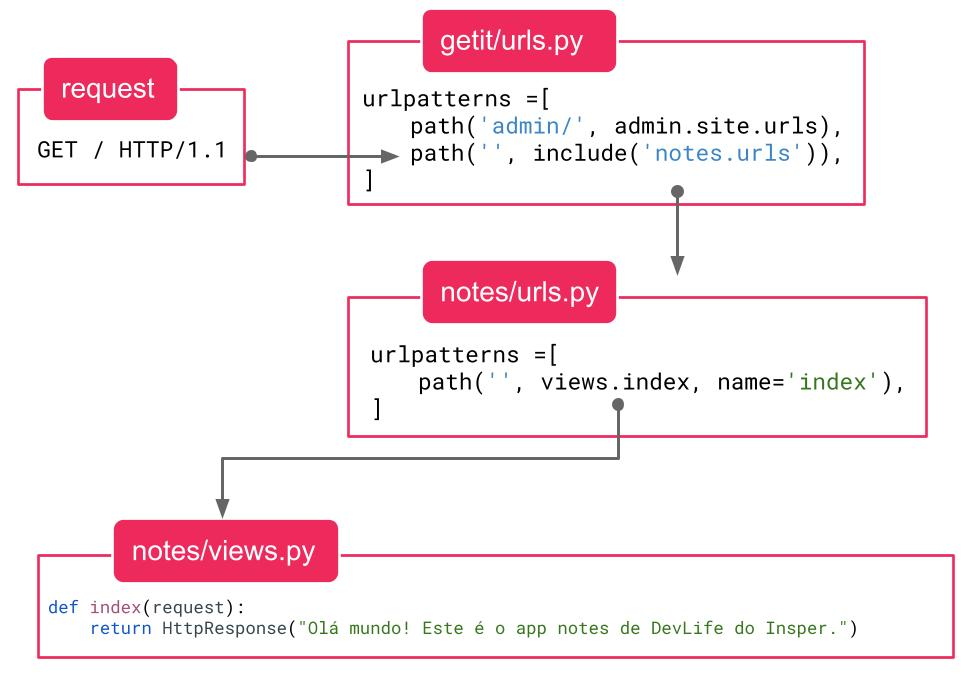
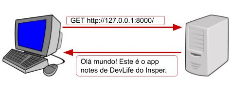

Deixaremos os modelos e o banco de dados de lado por enquanto. Depois de aprendermos a utilizar as urls e views nós voltaremos a eles para juntar todos os conceitos.

Agora a nossa tarefa será fazer um `hello world` usando o Django. Queremos que, ao acessar a página [`http://localhost:8000`](http://localhost:8000) o usuário veja o texto `"Olá mundo! Este é o app notes de DevLife do Insper."` na tela do navegador.

Retomando o nosso diagrama:


O primeiro passo dentro do Django é utilizar o caminho obtido da URL no arquivo `urls.py`. Abra o arquivo `getit/urls.py` do seu projeto. O conteúdo dele será similar a este:

```python
"""
URL configuration for getit project.

The `urlpatterns` list routes URLs to views. For more information please see:
    https://docs.djangoproject.com/en/4.2/topics/http/urls/
Examples:
Function views
    1. Add an import:  from my_app import views
    2. Add a URL to urlpatterns:  path('', views.home, name='home')
Class-based views
    1. Add an import:  from other_app.views import Home
    2. Add a URL to urlpatterns:  path('', Home.as_view(), name='home')
Including another URLconf
    1. Import the include() function: from django.urls import include, path
    2. Add a URL to urlpatterns:  path('blog/', include('blog.urls'))
"""
from django.contrib import admin
from django.urls import path

urlpatterns = [
    path('admin/', admin.site.urls),
]
```

Quando acessamos o endereço `http://localhost:8000/admin/` para entrar na página do Django Admin, o `localhost:8000` foi utilizado para encontrar o computador (local) e a porta (8000). A partir disso, o caminho `admin/` foi utilizado pelo Django para decidir o que fazer a seguir.

O Django percorre a lista `#!python urlpatterns` procurando uma correspondência ao caminho recebido. No caso, ele encontrou a correspondência com o primeiro (e único) padrão e encaminhou o restante da execução para o app de `admin`.

A ordem dos elementos dessa lista é muito importante, pois o Django a percorre em ordem e assim que encontra a primeira correspondência, ele **para e não verifica as próximas**.

!!! exercise id_adiciona-padrao-url-vazio
    Modifique a lista `#!python urlpatterns` do arquivo `getit/urls.py` e adicione os imports necessários:

    ```python
    from django.contrib import admin
    from django.urls import include, path

    urlpatterns = [
        path('admin/', admin.site.urls),
        path('', include('notes.urls')),
    ]
    ```

O elemento que adicionamos no final da lista verifica a correspondência com a string vazia. Isso quer dizer que **qualquer string** será correspondida por esse último padrão.

!!! exercise short id_urlpatterns-ordem
    O que aconteceria se invertessemos a ordem dos elementos da lista? O que deixaria de funcionar?

    ```python
    urlpatterns = [
        path('', include('notes.urls')),
        path('admin/', admin.site.urls),
    ]
    ```

    !!! answer
        Vimos que o Django percorre a lista `#!python urlpatterns` em ordem verificando as correspondências. Ao tentarmos acessar o caminho `admin/`, o Django encontraria uma correspondência com a string vazia do primeiro elemento, e assim a página do Django Admin não seria mostrada. Lembre-se que a string vazia corresponde a qualquer caminho.

Ok, mas o que significa essa parte final (`#!python include('notes.urls')`)?

## Implementando padrões de URL de um app específico

!!! exercise choice id_acesso-sem-url
    Rode o servidor. Qual erro ocorreu?

    - [ ] `RuntimeError: Unknown app 'notes.urls'`
    - [ ] `RuntimeError: Unknown app 'getit.urls'`
    - [x] `ModuleNotFoundError: No module named 'notes.urls'`
    - [ ] `ModuleNotFoundError: No module named 'getit.urls'`

    !!! answer
        Ao tentar criar os padrões de URL o Django não encontra o arquivo `notes/urls.py` e gera o erro que você observou.

Vamos corrigir o erro acima. A função `#!python include('notes.urls')` faz com que a busca da correspondência de uma string continue em outro arquivo `urls.py`, no caso no `notes/urls.py`. Assim, quando dissemos que a string vazia corresponde a qualquer string, era uma afirmação parcialmente correta. Caso o Django não encontre o resto do caminho no arquivo definido, o resultado será um erro indicando que o caminho não encontrou nenhuma correspondência.

!!! exercise id_cria-notes-urls
    Crie o arquivo `notes/urls.py` com o seguinte conteúdo:

    ```python
    from django.urls import path

    from . import views

    urlpatterns = [
        path('', views.index, name='index'),
    ]
    ```

O código acima cria um padrão de url com outra string vazia. Caso encontre uma correspondência, a função `views.index` será chamada para a obtenção da resposta HTTP a ser devolvida pelo servidor.

## Implementando a primeira view

A função `views.index` ainda não existe. Se tentássemos executar o servidor agora, ocorreria um erro. Vamos então implementar essa função.

Abra o arquivo `notes/views.py`. Nesse arquivo nós definiremos as nossas *views*. No contexto do Django, uma view é uma função que recebe uma requisição (com todos os parâmetros já processados e armazenados em um objeto) e devolve uma resposta.

!!! exercise id_implementa-view
    Substitua o conteúdo do arquivo pelo conteúdo a seguir:

    ```python
    from django.http import HttpResponse

    def index(request):
        return HttpResponse("Olá mundo! Este é o app notes de DevLife do Insper.")
    ```

!!! exercise id_testa-servidor
    Execute o servidor com o comando `python manage.py runserver` e acesse sua página em [`http://localhost:8000`](http://localhost:8000). O texto da resposta deve ser mostrado no navegador.

!!! info "Dica"
    Você pode deixar um terminal rodando o comando `python manage.py runserver` sem parar. Assim que você salva um arquivo o servidor de desenvolvimento vai reiniciar automaticamente e o novo código será utilizado.

!!! danger "Importante"
    Note que passamos `views.index` como argumento. Isso quer dizer que [a função em si é usada como argumento]()[^1]. Ela ainda não foi executada/chamada. Ela só será executada quando a rota for acessada por um cliente.

[^1]: **Curiosidade:** podemos fazer isso porque em Python, funções são *objetos de primeira classe*. Isso significa que funções podem ser armazenadas em variáveis, passadas como argumentos de funções e armazenar atributos como qualquer outro objeto em Python.

O diagrama abaixo mostra um resumo do fluxo que desenvolvemos nesta página:



A requisição chega no servidor rodando o Django, que usa o caminho (no caso vazio, pois o acesso foi feito à URL `http://localhost:8000`) para encontrar a view a ser executada (`views.index`), que recebe um objeto com a requisição e devolve uma resposta com o texto `#!python "Olá mundo!"`.

Se formos observar apenas o que acontece entre os computadores da rede (requisição e resposta), teremos algo assim:



!!! exercise id_mapeando-rotas
    Faça o exercício ["Mapeando rotas"](../exercises/mapeando_rotas_em_views/index.md)

Nós já aprendemos em outros momentos do semestre a fazer páginas web com HTML. Então vamos [colocar esse conhecimento em prática](views-com-html.md)!
